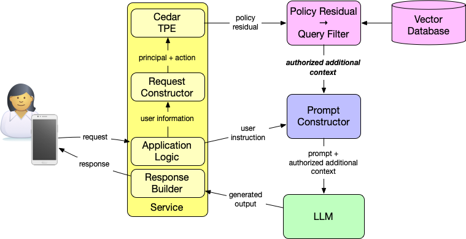

# Cedar TPE RAG Authorization Demo

This repository demonstrates a concrete pattern for building **authorization-scoped retrieval** in a RAG system:

1. **Cedar type-aware partial evaluation (TPE)** is used to evaluate policies with a known principal, action, and context, but an unknown resource.
2. Cedar produces a **residual policy** describing which resource attributes and relationships still matter for access.
3. The application **translates that residual into retrieval constraints** (a metadata filter).
4. Vector search runs **with those constraints applied**, so only authorized chunks can become LLM context.

This is not "policy in the prompt."  
Authorization is enforced *before* any sensitive context is assembled.

---

## System Architecture



In a retrieval-augmented generation (RAG) system, the application enriches a user's prompt with additional context retrieved from a vector database—documents, passages, or chunks that help the language model produce a more informed response. In an authorized RAG system, that enrichment is not generic or unconditional. As the diagram shows, authorization is evaluated before retrieval, not inside the prompt. Cedar's type-aware partial evaluation evaluates policy for a given principal and action and produces a policy residual, a constraint over resources. The application compiles that residual into a database-native query filter, ensuring that only authorized additional context is retrieved from the vector database. The prompt constructor then assembles the user's instruction together with this authorized additional context. The language model never decides what it is allowed to see; it operates entirely within a world that has already been shaped by authorization.

**The flow:**

1. A person asks a question in an application.
2. The application (acting as PEP) evaluates authorization using Cedar.
3. Cedar runs **partial evaluation** with an abstract resource.
4. Cedar returns a **residual condition** over resource attributes.
5. The application compiles that residual into a **vector DB filter**.
6. Vector search runs with the filter applied.
7. Only authorized chunks are assembled as context for the model.

---

## What this repo is (and isn't)

**This repo is:**
- A hands-on demo of policy-driven retrieval in a RAG pipeline
- An example of using Cedar TPE outputs to constrain vector search
- A minimal multi-tenant collaboration dataset (companies, users, shared documents)

**This repo is not:**
- A full RAG application or UI
- An agentic system
- A production reference architecture

The goal is to make one architectural boundary concrete:

> **The model never sees unauthorized data because the system never retrieves it.**

---

## Repository layout

- `cedar/` — Cedar schema, policies, and entities
- `data/` — demo documents and chunk metadata
- `src/tpe/` — Node scripts to run Cedar partial evaluation
- `src/compile/` — residual → datastore filter translation
- `src/ingest/` — embedding and OpenSearch ingest
- `src/retrieve/` — filtered vector queries and context assembly
- `src/lib/` — shared utilities for Cedar and OpenSearch
- `examples/` — sample requests, residuals, and queries
- `infra/` — optional AWS OpenSearch Serverless setup

---

## Prerequisites

- Node.js 18+
- npm or pnpm
- **Cedar CLI** with experimental TPE feature enabled (see below)
- Optional: AWS account for OpenSearch Serverless

### Cedar CLI Setup

This demo uses the Cedar CLI for type-aware partial evaluation (TPE), which is currently an **experimental feature**. You'll need to build the Cedar CLI from source with the experimental feature enabled.

**Option 1: Build from source (recommended)**

1. **Install Rust and Cargo** (if not already installed):
   ```bash
   curl --proto '=https' --tlsv1.2 -sSf https://sh.rustup.rs | sh
   ```

2. **Install protobuf compiler** (required for building Cedar):
   ```bash
   # macOS
   brew install protobuf
   
   # Linux (Ubuntu/Debian)
   sudo apt-get install protobuf-compiler
   ```

3. **Clone and build Cedar CLI with TPE feature:**
   ```bash
   git clone https://github.com/cedar-policy/cedar.git
   cd cedar
   cargo build --release --bin cedar --features tpe
   ```

4. **Add to PATH** (or use full path):
   ```bash
   # Add to ~/.zshrc or ~/.bashrc
   export PATH="$PATH:$(pwd)/target/release"
   ```

5. **Verify installation:**
   ```bash
   cedar --version
   cedar tpe --help  # Should show TPE command help
   ```

**Option 2: Use pre-built binaries (if available)**

If the Cedar project provides pre-built binaries with TPE enabled, you can use those instead. Check the [Cedar releases page](https://github.com/cedar-policy/cedar/releases) for availability.

**Note:** The TPE feature must be enabled at compile time. If you see an error like `option 'tpe' is experimental, but this executable was not built with 'partial-eval' experimental feature enabled`, you need to rebuild with `--features tpe` as shown above.

---

## Quick Start

Get up and running in minutes:

1. **Set up Cedar CLI** (see Prerequisites section above for detailed instructions):
   ```bash
   # Build Cedar CLI with TPE experimental feature
   git clone https://github.com/cedar-policy/cedar.git
   cd cedar
   cargo build --release --bin cedar --features tpe
   export PATH="$PATH:$(pwd)/target/release"
   ```

2. **Clone and install dependencies:**
   ```bash
   git clone https://github.com/windley/cedar-rag-authz-demo.git
   cd cedar-rag-authz-demo
   npm install
   ```

2. **Review the policy model:**
   ```bash
   # Inspect the Cedar schema and policies
   cat cedar/schema.cedarschema
   ls cedar/policies/
   ```

3. **Run a partial evaluation example:**
   ```bash
   # Generate a residual policy for customer "kate"
   node src/tpe/partial-eval.js \
     --principal 'Platform::Customer::"kate"' \
     --action 'Platform::Action::"view"' \
     --resource-type Platform::Chunk \
     --out out/residual-kate.json
   ```

4. **Compile the residual to a filter:**
   ```bash
   # Translate residual into OpenSearch filter
   node src/compile/residual-to-filter.js \
     --residual out/residual-kate.json \
     --out examples/queries/opensearch-filter-kate.json
   ```

5. **Verify expected access:**
   ```bash
   # Check example requests and expected outcomes
   cat examples/requests/kate-view.json
   cat examples/expected/kate-scope.json
   ```

This demonstrates the core pattern: Cedar produces a residual describing authorized resources, which is compiled into a vector database filter that enforces access *before* retrieval.

For detailed explanations, see the steps below.

---

## Interactive Demo Notebook

For a guided, interactive walkthrough of the entire demo, use the Jupyter notebook:

```bash
# Install Jupyter if you haven't already
pip install jupyter

# Launch Jupyter
jupyter notebook demo.ipynb
```

The notebook (`demo.ipynb`) provides:

- **Step-by-step walkthrough** of the authorization flow
- **Interactive execution** of TPE and compilation steps
- **Visual comparisons** of different principals (Kate, Alice, Mallory)
- **Explanations** of residual policies and OpenSearch filters
- **Complete flow diagram** showing how authorization-scoped retrieval works

The notebook covers:
1. Understanding the policy model (schema, policies, entities)
2. Running type-aware partial evaluation for different principals
3. Compiling residuals to OpenSearch filters
4. Comparing authorization scopes across principals
5. Understanding the complete RAG authorization flow

This is the recommended way to explore the demo interactively.

---

## Inspect the policy model

Start by reviewing:

- `cedar/schema.cedarschema`
- `cedar/policies/`
- `cedar/entities.json`

The policies model a multi-tenant collaboration platform where access depends on:
- tenant membership
- team-based sharing
- document classification

### About Chunks and Resource Naming

**Note:** The `cedar/entities.json` file includes chunk entities (e.g., `"q3-plan#1"`, `"hr-note#1"`) for demo/testing purposes. In a production RAG system, chunk entities are not required for TPE—only principal entities are needed. Chunk data is stored in the vector database with metadata fields that match the resource attributes referenced in policies.

In this demo, documents are split into **chunks** for vector search. Chunk identifiers follow the pattern `{document-id}#{chunk-number}`:

- `q3-plan#1` = chunk #1 of the "q3-plan" document
- `hr-note#1` = chunk #1 of the "hr-note" document
- If a document had multiple chunks, you'd see: `q3-plan#1`, `q3-plan#2`, `q3-plan#3`, etc.

**Important notes:**

- **Policies don't reference specific chunks** - they reference resource attributes (like `resource.tenant`, `resource.customer_readers_team`). This allows policies to work with any chunk without hardcoding IDs.

- **For TPE, chunk entities aren't required** - Type-aware partial evaluation only needs:
  - Principal entities (to know their attributes like `tenant`, `teams`)
  - The schema (to understand resource type structure)
  - Chunk entities in `entities.json` are included for demo/testing purposes only

- **In production**, chunks are stored in the vector database with metadata fields that match the attributes referenced in policies. The authorization filter derived from TPE is applied at query time to ensure only authorized chunks are retrieved.

**Note about `cedar/entities.json`:** This file includes chunk entities (e.g., `"q3-plan#1"`, `"hr-note#1"`) for demo/testing purposes. In a production RAG system, you would only need principal entities in `entities.json` for TPE. Chunk data lives in your vector database with metadata fields that correspond to the resource attributes referenced in policies (tenant, classification, customer_readers_team, employee_readers_team, etc.).

---

## Running partial evaluation (emit a residual)

Example (illustrative command):

```bash
node src/tpe/partial-eval.js \
  --principal 'Customer::"kate"' \
  --action 'Action::"ask"' \
  --context examples/requests/context-tenant-a.json \
  --resource-type Chunk \
  --out out/residual-kate.json
```

This runs Cedar with:
- a known principal and action
- known runtime context
- an abstract resource

The output is a residual policy describing what must be true about a Chunk
for access to be permitted.

# Compile the residual into a retrieval filter
This step is *application logic,* not Cedar logic.

Cedar does not generate database queries.
It tells you which attributes and relationships still matter.

## Index and query OpenSearch Serverless (optional)

This repo can optionally demonstrate enforcement using a real vector database.

High-level flow:
1. Create an OpenSearch Serverless collection and index (see infra/)
2.	Embed and ingest chunks with metadata (see src/ingest/)
3.	Run a k-NN query with the compiled filter applied (see src/retrieve/)

Example query shape:
- vector similarity clause
- metadata filter derived from Cedar residual

## Key correctness guarantees

This demo is intentionally strict about boundaries:
- Cedar decides authority.
- The application enforces scope.
- Retrieval is constrained before context exists.
- Prompts express intent, not access control.

The residual-to-filter translation is explicit so it can be audited, tested, and reasoned about.

## Status

Current focus:
- ✅ Policy model for a multi-tenant collaboration platform
- ✅ Sample requests and expected access outcomes
- ✅ Cedar TPE invocation via Node (using Cedar CLI with experimental features)
- ✅ Residual → OpenSearch filter compilation
- ⏳ OpenSearch Serverless ingest + filtered retrieval
- ⏳ End-to-end "authorized context" output
